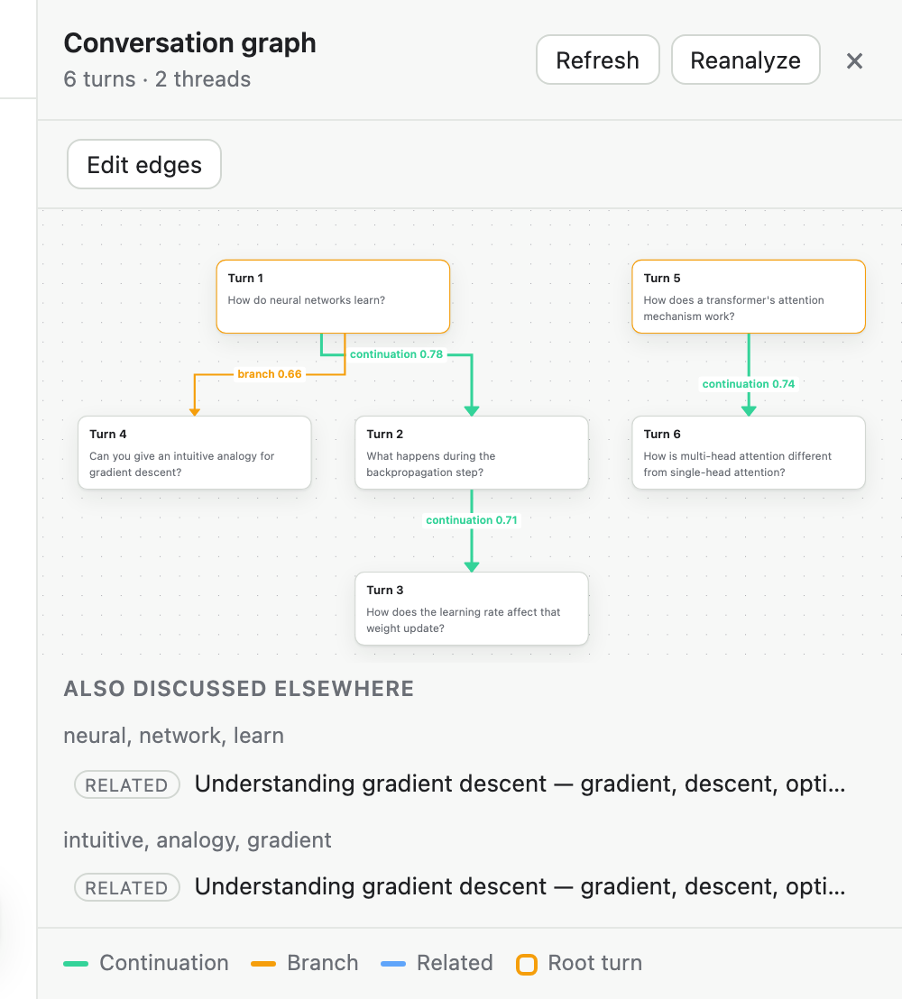
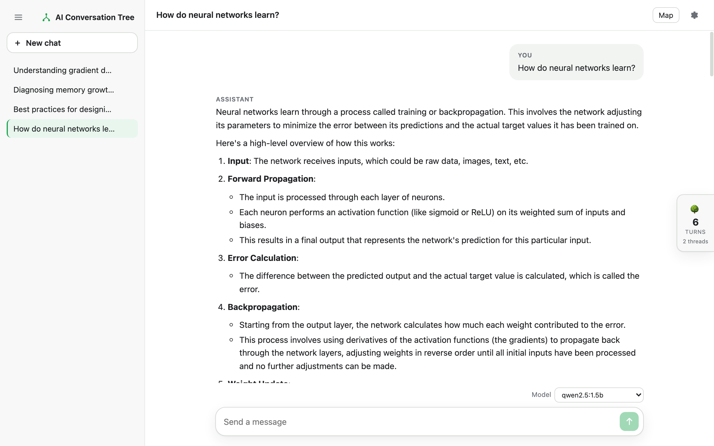
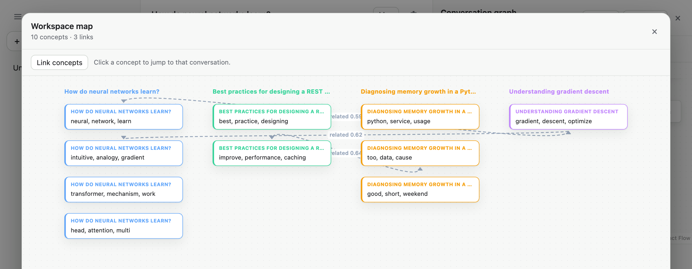

# AI Conversation Tree

`AI Conversation Tree` is a local-first proof of concept for analyzing chat structure.

It takes a sequence of user/assistant turns, classifies how each new turn relates to earlier turns, stores the result, and renders the conversation both as a normal chat and as a graph.

Current goals:

- validate graph logic
- persist conversations locally
- test with local models through `Ollama`, switchable per conversation
- link concepts across separate conversations
- provide a chat-first viewer with a graph drawer for inspection

This is not intended to be production-ready. It is intended to be technically solid, explainable, and useful as a portfolio project.



## What It Does

For each new turn, the system decides whether it is:

- a `continuation` of an existing topic
- a `branch` off a previous answer or subthread
- `related` to one or more prior topics
- effectively unrelated, in which case it starts a new root thread

The result is stored as:

- conversation records
- turns
- semantic edges
- concept assignments
- concept links across conversations
- embeddings

and rendered as a chat with a graph drawer.

Separately, once a turn lands or a conversation is re-analyzed, every concept in
that conversation is scored against the concepts of every *other* conversation.
Close pairs become `conceptLinks`, surfaced in the drawer as "also discussed
elsewhere" and over `GET /concepts/graph`.

Response generation runs through a stub, a local `Ollama` model, `OpenAI`,
`Anthropic`, or `Gemini`. The environment sets the default; the UI and API can
override it per conversation. Ollama, OpenAI, and Anthropic support native
incremental streaming; Gemini currently falls back to one response chunk.

## Core Approach

### Immediate Previous Turn

The immediate previous turn gets the strongest classifier. It combines three
signal sources:

- **embedding similarity** — `all-MiniLM-L6-v2` cosine between the new user
  message and the previous turn (`user + " " + ai`)
- **discourse features** — regex pattern families (clarification, reference,
  bare pronoun, forward / "how do I", comparison, lateral shift) plus lexical
  and content-term overlap
- **cross-encoder scores** — `cross-encoder/ms-marco-MiniLM-L-6-v2` run once
  per candidate label with a label-specific prompt

Discourse features decide which labels are *eligible*; the embedding and
cross-encoder signals set the confidence. A label is only scored when
something anchors it to the previous turn:

- `branch` — a clarification / reference / pronoun cue **with** a trace of
  shared topic under it (so a bare "why …?" after a hard topic switch is not a
  branch off nothing), or a confident cross-encoder `branch` score (the new
  question is answerable straight from the last answer)
- `continuation` — a "how do I … next" marker on an established topic, a
  comparison follow-up, a bare pronoun pointing back, or the message just
  staying on topic (high raw similarity to the turn or its answer) with no
  lateral-shift marker
- `related` — a "what about X instead" lateral shift, two parallel `what is X`
  questions about the same area, or real surface anchoring (shared content
  terms plus topic overlap) without a shift marker

Each eligible label's confidence blends its heuristic score, its cross-encoder
score, and the embedding similarities. The highest wins if it clears
`edgeConfidenceThreshold` (0.45); otherwise the turn gets **no edge** and
starts a new root.

`eval_immediate_previous.py` (driven by `eval_cases.json`) grades this on 27
cases across the four outcomes, plus 3 `knownGap` cases the bi-encoder can't
resolve — anaphora with no shared terms, acronyms it doesn't know — which are
reported but not graded.

### Older Prior Turns

Older-turn linking uses batched vector retrieval first, then classification.

Current flow:

1. score earlier turn embeddings in one NumPy matrix operation, minus a small
   decay for older turns
2. keep only the top few candidates
3. classify each selected older link as `continuation` or `related`

At this scale a direct scan is cheap and avoids the concept-centroid layer,
whose average embedding is a poor representative once a concept has drifted.

### Cross-Conversation Concept Links

A concept is the set of turns that share a `conceptId` inside one conversation.
`conceptIndex.py` compares concepts *across* conversations:

1. group every turn embedding by `(conversationId, conceptId)` and L2-normalise
2. score two concepts as the mean of the top-3 pairwise cosine similarities
   between their member turns — top-k, not max (one stray turn pair should not
   forge a link) and not the full mean (which dilutes a broad concept)
3. use normalized concept centroids to shortlist candidate pairs, then apply
   exact top-3 member scoring; `>= 0.66` is a `same` link, `>= 0.52` is
   `related`; cap 3 links per concept
4. concepts with no turn of at least four distinct word tokens are skipped, so
   greetings and acknowledgements do not link

`conceptId`s are reassigned from zero on every re-analysis, so each concept
also carries a stable `conceptKey` (`turnConcepts.conceptKey`): a re-analysed
concept inherits the key of the old concept it overlaps most (Jaccard >= 0.5,
matched greedily), and anything new gets a fresh key. `conceptLinks` is keyed
by this pair of `conceptKey`s, not by `(conversationId, conceptId)` — so a link
keeps pointing at the same concept across re-analysis. `auto` links are still
deleted and rebuilt on every change — debounced on the send path, forced on
re-analysis. A `manual` link (`POST /concept-links`) is left alone by that
rebuild and only disappears if one of its two concepts stops existing (a
concept that did not survive re-analysis, or its conversation was deleted) —
`pruneOrphanConceptLinks` runs in both of those transactions.
Thresholds were tuned against `eval_concept_links.py`: with
`all-MiniLM-L6-v2` on short questions, "same topic, different wording" pairs
land around 0.55-0.65 while the nearest false positives sit below 0.48.
Genuinely adjacent topics the model cannot lift out of the noise floor stay
unlinked by design.

**Tried and rejected: blending in the cross-encoder.** The immediate-turn
classifier gets real value from `cross-encoder/ms-marco-MiniLM-L-6-v2` (see
"Immediate Previous Turn" above), so it seemed worth trying for concept
scoring too. Measured against the same pairs `eval_concept_links.py`'s
thresholds were tuned on (full questions and short label-style text alike): it
reproduces cosine's
top-3 ranking almost exactly (0.65-0.96) and returns ~0.000 for every other
pair — including the ones cosine alone can't separate from noise, like
"train a neural network" vs. "overfitting in machine learning" (0.239
cosine, 0.00003 cross-encoder) or "REST API design" vs. "GraphQL API design"
(0.405 cosine, 0.012 cross-encoder). It's a query-passage reranker; two full
questions from unrelated conversations aren't the (short query, passage)
shape it was trained on, so it just strongly confirms whatever cosine was
already confident about and adds no signal in the gray zone — not worth the
extra model call per candidate pair.

Each concept is labelled by its most distinctive terms — term frequency
(across the concept's own turns) times inverse concept frequency (rarer
across the workspace scores higher), using a label-specific stopword list
(`conceptIndex._labelStopwords`, broader than the classifier's own) — rather
than by its first question verbatim, so "python, decorator" instead of "how
do decorators work in python". A concept with no content terms at all (a
greeting) falls back to that trimmed first question.

### Important Design Principle

Topic identity should dominate continuation decisions.

Discourse features are used as supporting evidence, not as ground truth. This reduces false positives where generic follow-up phrasing looks like continuation even when the topic changed.

## Tech Stack

Backend:

- `Python`
- `FastAPI`
- `SQLite`
- `Pydantic`
- `NumPy`
- `sentence-transformers`
- `CrossEncoder`
- `PyTorch`
- `Ollama` (local), `OpenAI`, `Anthropic`, or `Gemini` for response generation;
  a stub mode needs neither

Frontend:

- `React` + `Vite`
- `React Flow` for the graph canvas
- `Dagre` for hierarchical graph layout

## Project Structure

Backend:

- `api.py`
  - HTTP routes
- `chatService.py`
  - orchestration, provider calls, graph payload serialization
- `graphService.py`
  - `ConversationGraph` model, classification logic, concept retrieval, reanalysis
- `conceptIndex.py`
  - cross-conversation concept scoring, link rebuild, concept labels
- `graphStore.py`
  - per-conversation graph cache (LRU) and per-conversation write lock
- `vectorStore.py`
  - optional PostgreSQL/pgvector HNSW index for scalable turn retrieval, with
    automatic fallback to local NumPy search
- `analysisService.py`
  - conversation summaries, cross-chat semantic search, and Markdown/JSON
    report generation
- `db.py`
  - `SQLite` schema and helpers
- `models.py`
  - application data models

Frontend (`frontend/src/`):

- `App.jsx`
  - shell: conversation state, layout
- `api.js`
  - fetch wrappers
- `useConversation.js`
  - hook owning one conversation's turns, graph, and concept links, plus the send / analyze / refresh actions
- `components/`
  - `ConversationSidebar`, `ChatTranscript`, `Composer` (with the model picker),
    `GraphRail`, `GraphDrawer` (with the "also discussed elsewhere" panel),
    `TurnGraph`, `WorkspaceMap`

## Persistence Model

Everything is saved locally in `.data/conversationTree.db` (`SQLite`, WAL mode)
by default. Set `AI_CONVERSATION_TREE_DB` to choose another path. Runtime data
is ignored by Git; the old root-level `conversationTree.db` is retained only
as a legacy sample database.

- `conversations` — `model` column holds the conversation's default response
  model (`stub`, `ollama:<name>`, or `openai:<name>`); null means use the
  environment default
- `turns`
- `semanticEdges` — each edge carries an `origin` of `auto` (classifier) or `manual` (hand-created via `POST /edges`)
- `turnConcepts` — `conceptKey` is a stable per-concept identity carried across
  re-analysis by turn overlap; the integer `conceptId` is only a within-
  conversation label
- `conceptLinks` — similarity links between two `conceptKey`s in *different*
  conversations; the pair is stored once in a canonical order (no FK — a
  key's rows live in `turnConcepts`; `pruneOrphanConceptLinks` deletes a link
  once either key no longer exists), with an `origin` of `auto` (rebuilt on
  every change) or `manual` (hand-created via `POST /concept-links`)
- `turnEmbeddings` — one `float32` vector per turn, stored as a `BLOB`
  (`np.frombuffer` / `.tobytes()`), not JSON text

The first request for a conversation rebuilds its in-memory `ConversationGraph`
from persisted rows; `graphStore` then keeps it cached. Each cache entry carries
the conversation's SQLite `updatedAt` version and is reloaded when another
backend process changes that conversation, so multiple workers do not retain
stale graph state.

## API

### Model Endpoints

- `GET /models` — installed `Ollama` tags (queried live from `/api/tags`), the
  configured `OpenAI` model, and `stub`, plus the current default and whether
  `Ollama` is reachable

### Conversation Endpoints

- `POST /conversations` — optional `model` sets the conversation default
- `GET /conversations`
- `GET /conversations/{conversationId}`
- `PATCH /conversations/{conversationId}` — set the conversation's default
  response model (`{"model": "ollama:<name>"}`); validated against the same
  `stub` / `ollama:<name>` / `openai:<name>` shape
- `DELETE /conversations/{conversationId}`

### Turn Endpoints

- `POST /conversations/{conversationId}/turns` — optional `model` overrides the
  provider for this turn and becomes the conversation's new default; a provider
  failure returns `502`. If this is the conversation's first turn and it has no
  title yet, the title becomes the user message (collapsed, trimmed to 60 chars
  on a word boundary) — a title given at creation (`POST /conversations`) is
  never overwritten
- `POST /conversations/{conversationId}/turns/stream` — same request body and
  side effects (model override, auto-title, concept relink), but the response
  is `text/event-stream`: any number of `{"type": "delta", "text": "..."}`
  events as the reply is generated, then one
  `{"type": "done", "turnId", "aiText", "turns", "nodes", "edges"}` carrying
  the same payload the blocking endpoint returns. A provider or persistence
  failure arrives as `{"type": "error", "message": "..."}` instead of an HTTP
  error status — by the time that can happen the response has already started
  with `200`, so there's no status left to change. `Ollama` and the stub
  stream incremental chunks; Gemini currently sends its whole reply as one
  `delta`
- `GET /conversations/{conversationId}/turns`

### Analysis Endpoints

- `GET /conversations/{conversationId}/summary` — deterministic local summary
  with turn count, thread count, relationship count, and topic terms
- `GET /search?query=...&limit=20` — semantic search across all conversations;
  uses pgvector/HNSW by default and falls back to local NumPy search
- `GET /conversations/{conversationId}/report?format=markdown|json` — download
  an analysis report containing the summary, topics, turns, and semantic edges

### Graph Endpoints

- `POST /conversations/{conversationId}/analyze` — recomputes the classifier
  (`auto`) edges and every turn's root / concept assignments in a single
  transaction; `manual` edges are left in place, then concept links are rebuilt
- `GET /conversations/{conversationId}/graph`
- `GET /conversations/{conversationId}/concept-links` — this conversation's
  concepts, each grouped with the other conversations/concepts it links to
  (label, title, score, `same` / `related`); shaped for the drawer

### Concept Link Endpoints

- `GET /concepts/graph` — the whole workspace: every concept a node
  (`conversationId`, `conceptId`, `conceptKey`, `label`, `turnCount`,
  `conversationTitle`), every link an edge (`id`, `a`, `b`, `score`, `kind`,
  `origin`); each endpoint of an edge also carries its `conceptKey`
- `POST /concepts/relink` — rebuild every conversation's `auto` concept links
  (for a threshold change or to repair drift); returns `{"linkCount": n}`
- `POST /concept-links` — hand-link two concepts by `conceptKey`:
  `{"aConceptKey", "bConceptKey", "kind": "same" | "related"}`; `origin` is
  `manual`, score fixed at `1.0`; `404` if either key is unknown
- `DELETE /concept-links/{linkId}`

### Edge Correction Endpoints

- `POST /edges`
- `PATCH /edges/{edgeId}`
- `DELETE /edges/{edgeId}`

`POST /edges` validates that both turns exist in the conversation, that
`fromTurnId` is earlier than `toTurnId`, that `label` is one of
`continuation` / `branch` / `related`, and that `confidence` is in `[0, 1]`.
Hand-created edges are marked `origin: "manual"` and are preserved when a
conversation is re-analyzed; classifier edges (`origin: "auto"`) are rebuilt.

### Debug Endpoint

- `POST /debug/immediate`

## Stable Graph Output

Graph endpoints return stable JSON:

```json
{
  "nodes": [
    {
      "id": 0,
      "userText": "what are cats?",
      "aiText": "...",
      "conceptIds": [0],
      "root": true,
      "timelineParent": null
    }
  ],
  "edges": [
    {
      "id": 1,
      "fromTurnId": 0,
      "toTurnId": 1,
      "label": "related",
      "confidence": 0.696,
      "origin": "auto"
    }
  ]
}
```

Semantics:

- green edge = `continuation`
- orange edge = `branch`
- blue bidirectional edge = `related`
- orange node border = `root`

`GET /concepts/graph` returns the cross-conversation view:

```json
{
  "nodes": [
    {
      "conversationId": 1,
      "conceptId": 0,
      "conceptKey": "9f2c…",
      "label": "characteristic, key, cat",
      "turnCount": 2,
      "conversationTitle": "Cats"
    }
  ],
  "edges": [
    {
      "id": 7,
      "a": { "conversationId": 1, "conceptId": 0, "conceptKey": "9f2c…" },
      "b": { "conversationId": 4, "conceptId": 2, "conceptKey": "7ab1…" },
      "score": 0.71,
      "kind": "same",
      "origin": "auto"
    }
  ]
}
```

## Interface

The viewer at `/ui` is a normal chat: a conversation list on the left, the
transcript in the middle, a composer at the bottom.



The composer has a model picker populated from `GET /models`. Choosing a model
sends it with each turn and stores it as the conversation's default; a new chat
inherits the current selection, and switching conversations adopts that
conversation's stored model. The last choice is kept in `localStorage`.

The graph lives in a drawer on the right:

- a pill on the right edge shows the turn count; click it (or press
  `Cmd/Ctrl+G`) to slide the graph drawer open
- the graph is laid out top-to-bottom by `Dagre` along the primary-parent spine;
  branch and related links are drawn as secondary curves
- clicking a graph node scrolls the transcript to that turn and highlights it
- the drawer header has `Refresh` and `Reanalyze`
- `Edit edges`, above the graph, switches to hand-editing mode for this
  conversation's own edges (`POST`/`PATCH`/`DELETE /edges`) — a label picker
  (`continuation`/`branch`/`related`) next to it sets what the next pair
  creates. Click a turn, then another: if no manual edge exists between them
  yet, this creates one with the current label; if one already does, this
  relabels it instead of creating a duplicate — the same two-click gesture
  covers both. Click a manually-created edge to remove it; clicking a
  classifier (`auto`) edge in this mode does nothing but say so. Outside edit
  mode, clicking a node behaves as above (select and scroll)
- below the graph, an "also discussed elsewhere" panel lists the other
  conversations that share the selected turn's concept(s); each is a button that
  switches to that conversation

The `Map` button in the chat header opens a full-screen workspace map: every
concept across every conversation as a node, laid out in a grid clustered and
coloured by conversation, with the cross-conversation concept links as edges.
Clicking a concept switches to that conversation.

The chat header also provides:

- `Search` — semantic search across all stored conversations
- `Summary` — a local summary of the active conversation and its detected topics
- `Export` — downloads a Markdown analysis report; JSON reports are available
  through the report API



Every row of clusters has a genuinely empty gap above and below it (nothing is
ever drawn there); an edge between two nodes that a straight line would cut
through other clusters to reach is routed through that gap instead — down or
up out of its own row, across, and into the target's row from its own gap. Two
concepts more than one row apart share no single gap, so that case adds one
more hop: out to a fixed vertical lane past the last column, then down to the
target's row. Same-conversation or same-row-adjacent-column edges skip all of
this — a straight line already doesn't cross anything.

`Link concepts` in the map toolbar switches to hand-linking mode: click one
concept, then another, to `POST /concept-links` a `manual` link between them
(the toggle next to it picks `related` or `same`); a pinned link is drawn in a
third colour and labelled "pinned". Clicking a pinned link removes it; clicking
an `auto` link in this mode does nothing — those come from the classifier, not
from a click.

Assistant replies stream in token by token via
`POST /conversations/{conversationId}/turns/stream` (`text/event-stream`); the
composer shows a typing indicator until the first chunk arrives, then grows
the reply in place. Classification and persistence still happen only once the
full reply is in — the graph, concept links, and title update right after the
stream ends, same as the blocking path.

The UI follows the browser's light/dark preference.

## Local Setup

### 1. Python environment

```bash
python3 -m venv venv
source venv/bin/activate
pip install -r requirements.txt
```

### Optional pgvector acceleration

For larger workspaces, start PostgreSQL with the included Compose file:

```bash
docker compose -f docker-compose.pgvector.yml up -d
```

That local connection is the default. Set `PGVECTOR_DATABASE_URL` when using a
different PostgreSQL instance. On the next request, the app creates the `vector` extension, mirrors new turn
embeddings into PostgreSQL, and uses an HNSW cosine index for older-turn
retrieval. SQLite remains the source of truth for conversations, turns, and
graph edges. If PostgreSQL is unavailable, retrieval automatically falls back
to the local NumPy implementation.

### 2. Frontend build

```bash
cd frontend
npm install
npm run build
cd ..
```

### 3. Choose a default response mode

These environment variables set the *default* provider. Any conversation can
override it from the composer's model picker, `PATCH /conversations/{id}`, or a
`model` field on `POST .../turns`; `GET /models` lists what is available.

Resolution order when a conversation has no stored model: `OLLAMA_MODEL`, then
`AI_CONVERSATION_TREE_STUB_LLM=1`, then `OPENAI_API_KEY`.

#### Stub mode

```bash
export AI_CONVERSATION_TREE_STUB_LLM=1
```

#### Ollama mode

Example:

```bash
export OLLAMA_MODEL=qwen2.5:0.5b
export OLLAMA_BASE_URL=http://127.0.0.1:11434
unset AI_CONVERSATION_TREE_STUB_LLM
```

Use a small model for fast graph testing. The point is to generate turns quickly, not maximize answer quality.

#### OpenAI mode

```bash
export OPENAI_API_KEY=your_key_here
export OPENAI_MODEL=gpt-5-mini
unset AI_CONVERSATION_TREE_STUB_LLM
```

### 4. Start the app

```bash
venv/bin/python -m uvicorn api:app --reload
```

Open:

- API: `http://127.0.0.1:8000`
- Viewer: `http://127.0.0.1:8000/ui` (served from `frontend/dist`)

For frontend development, run the backend on `:8000` and Vite separately:

```bash
cd frontend
npm run dev   # http://127.0.0.1:5173, proxies /conversations /edges /models /concepts to :8000
```

## Local Workflow

Typical workflow:

1. start a new chat
2. send turns through the UI or API
3. open the graph drawer to see how the turns relate
4. hit `Reanalyze` after changing classifier logic

The viewer is for inspecting graph behavior; it is a real chat interface but a
local, single-user one, not a hosted product.

## Example Requests

### Create a conversation

```bash
curl -X POST http://127.0.0.1:8000/conversations \
  -H "Content-Type: application/json" \
  -d '{"title":"Test conversation"}'
```

### Add a turn

```bash
curl -X POST http://127.0.0.1:8000/conversations/1/turns \
  -H "Content-Type: application/json" \
  -d '{"userText":"What are cats?"}'
```

### Add a turn with a specific model

```bash
curl http://127.0.0.1:8000/models

curl -X POST http://127.0.0.1:8000/conversations/1/turns \
  -H "Content-Type: application/json" \
  -d '{"userText":"What are cats?","model":"ollama:qwen2.5:0.5b"}'
```

### Add a turn and watch it stream

```bash
curl -N -X POST http://127.0.0.1:8000/conversations/1/turns/stream \
  -H "Content-Type: application/json" \
  -d '{"userText":"What are cats?"}'
```

`-N` disables curl's output buffering so the `delta` events print as they
arrive instead of all at once at the end.

### Get the graph

```bash
curl http://127.0.0.1:8000/conversations/1/graph
```

### Get the cross-conversation concept graph

```bash
curl http://127.0.0.1:8000/concepts/graph
curl http://127.0.0.1:8000/conversations/1/concept-links
```

### Reanalyze a conversation

```bash
curl -X POST http://127.0.0.1:8000/conversations/1/analyze
```

## Verification

Backend syntax:

```bash
venv/bin/python -m py_compile api.py chatService.py graphService.py conceptIndex.py graphStore.py db.py models.py
```

Persistence milestone:

```bash
HF_HUB_OFFLINE=1 TRANSFORMERS_OFFLINE=1 venv/bin/python testSqliteMilestone.py
```

Evaluation scripts:

```bash
HF_HUB_OFFLINE=1 TRANSFORMERS_OFFLINE=1 venv/bin/python eval_immediate_previous.py
HF_HUB_OFFLINE=1 TRANSFORMERS_OFFLINE=1 venv/bin/python eval_cross_links.py
HF_HUB_OFFLINE=1 TRANSFORMERS_OFFLINE=1 venv/bin/python eval_concept_links.py
```

`eval_immediate_previous.py` and `eval_cross_links.py` cover in-conversation
classification; `eval_concept_links.py` builds small conversations in throwaway
databases and checks which ones end up cross-linked.

`eval_immediate_previous.py` reads its cases from `eval_cases.json` (see
"Immediate Previous Turn" above for the graded / `knownGap` split). If a
`knownGap` case starts passing, the runner prints `NOW PASSES` — promote it to
a graded case and drop the flag.

Frontend build:

```bash
cd frontend && npm run build
```

## Current Limitations

- when pgvector is not configured, older-turn retrieval uses an exact scan over
  the conversation's embedding matrix; the pgvector path uses HNSW ANN search
- concept linking still uses centroid shortlists in Python; the first pgvector
  integration covers turn retrieval, while a future pass can move workspace-wide
  concept linking into a materialized vector index too
- `same` vs `related` is a two-threshold heuristic; `all-MiniLM-L6-v2` cannot
  reliably separate genuinely adjacent topics from noise, so recall is
  conservative
- a manual concept link always has kind `same` or `related` at score `1.0`;
  there's no way to record a weaker hand-made connection
- local `Ollama` latency depends heavily on hardware and model size
- the graph cache is process-local but validates each entry against SQLite's
  `updatedAt` version; SQLite still remains the write coordination point
- Gemini replies currently fall back to one chunk; its streaming JSON protocol
  is not yet implemented
- no auth, multi-user isolation, or production deployment concerns are addressed

## Future Work

### Conversation Intelligence

Implemented:

- conversation summaries with thread, edge, and topic counts
- semantic search across all conversations
- Markdown and JSON analysis report exports

Next:

- context-loss detection when an assistant response appears to ignore or
  contradict the active conversation thread

### Browser Extension

The most interesting product direction is a browser extension rather than a standalone app.

Goal:

- let users keep using `ChatGPT`, `Claude`, or `Gemini`
- read the visible conversation from the page
- build the conversation graph locally
- render the graph as a side panel

Planned work:

- browser extension scaffold
- content scripts for site-specific DOM extraction
- per-site adapters for `ChatGPT`, `Claude`, and `Gemini`
- local storage of extracted conversations
- graph viewer injected as a side drawer
- surface conversation summaries, context-loss warnings, and cross-chat search
  from the side panel
- optional connection to the current local backend for graph construction

### Postgres + pgvector

The optional pgvector path now provides PostgreSQL-backed HNSW retrieval for
turn embeddings while SQLite remains the source of truth for graph metadata.
A future hosted migration could move the remaining graph tables to PostgreSQL
as well, and could use a materialized vector index for cross-conversation
concept scoring.

### Retrieval Improvements

When pgvector is disabled, older-turn retrieval loads prior embeddings and
scores them in Python (cosine minus a small age decay). The local fallback is
intentionally retained for easy offline development.

Planned improvements:

- better candidate pruning and age-decay tuning
- optional topic/subtopic segmentation for large conversations

### Model / Classifier Improvements

Planned work:

- add more labeled evaluation cases
- calibrate thresholds using saved examples
- improve continuation vs related separation
- improve branch detection for clarification subthreads
- add better handling for malformed or low-quality assistant replies
- make confidence scores more interpretable

### Concept Links

Planned work:

- filtering the workspace map to linked concepts only

### UI / Product Improvements

Planned work:

- streaming support for Gemini's `streamGenerateContent` protocol
- conversation rename (auto-titling from the first message is done)
- graph filtering by edge type and subgraph focus

## Notes

- Runtime data lives in `.data/conversationTree.db` by default. Set
  `AI_CONVERSATION_TREE_DB` to migrate or use another database path. A legacy
  root-level `conversationTree.db` is no longer used by default.
- If you use `Ollama`, make sure the local Ollama server is running before starting the backend.
- For quick local testing, use a smaller Ollama model rather than a larger chat model.
